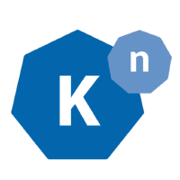

<h1 align="center">Knative Operator</h1>

# Knative Operator

Knative components build on top of Kubernetes, abstracting away the complex details and enabling developers to focus on what matters. Built by codifying the best practices shared by successful real-world implementations, Knative solves the "boring but difficult" parts of deploying and managing cloud native services so you don't have to.

The Knative Operator defines custom resources for the Knative components, serving and eventing, enabling users to configure, install, upgrade and maintain these components over their lifecycle through a simple API.

# Knative Serving
Knative Serving builds on Kubernetes to support deploying and serving of applications and functions as serverless containers. Serving is easy to get started with and scales to support advanced scenarios. Other features includes:

- Rapid deployment of serverless containers

- Automatic scaling up and down to zero

- Routing and network programming

- Point-in-time snapshots of deployed code and configurations

# Knative Eventing
Knative Eventing is a system that is designed to address a common need for cloud native development and provides composable primitives to enable late-binding event sources and event consumers. Knative Eventing is designed to address a common need for cloud native development:

- Services are loosely coupled during development and deployed independently

- A producer can generate events before a consumer is listening, and a consumer can express an interest in an event or class of events that is not yet being produced.

- Services can be connected to create new applications:
    - without modifying producer or consumer, and
    - with the ability to select a specific subset of events from a particular producer.

# Objective of tutorial

In this tutorial,we are going to cover following topics:

1. Install Prometheus Operator and verify its successful installation.
2. Create Custom Resource Definitions for Knative Serving and verify status of pods and services.
3. Create Custom Resource Definitions for Knative Eventing and verify status of pods and services.
4. Upgrading the Knative operator
5. Cleanup Operator

